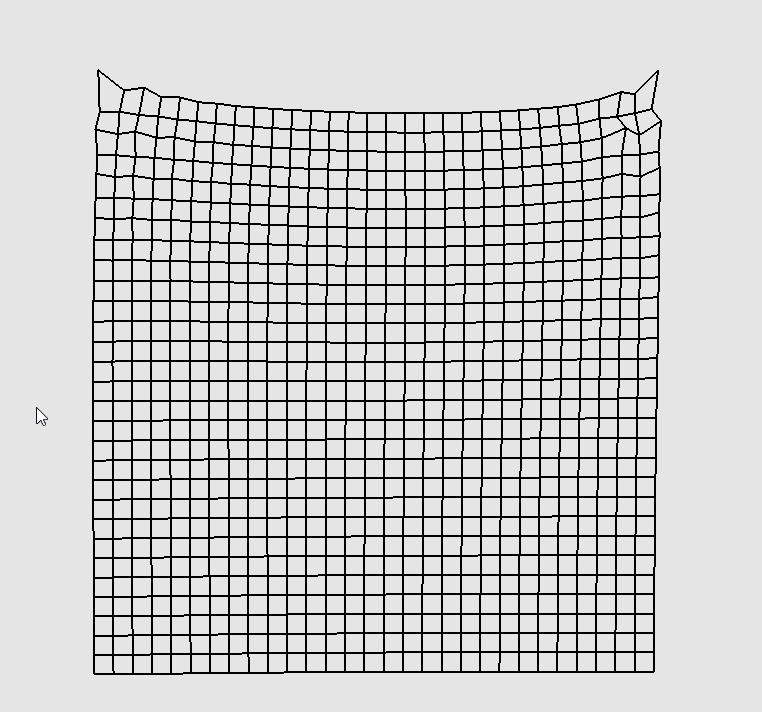

## Mass-Spring 

Constrain:
$$
C_{ij}(\mathbf{x}_i, \mathbf{x}_j) = \| \mathbf{x}_i - \mathbf{x}_j \| - d_{ij}
$$

Result:

## FEM(Based on Neo-Hookean Hyperelasticity Model)

Hydrostatic Constraint:

$$
C_H(\mathbf{F}) = \det(\mathbf{F}) - 1
$$

Deviatoric Constraint:
$$
C_D(\mathbf{F}) = \sqrt{\text{tr}(\mathbf{F}^T \mathbf{F})}
$$

Result:

*If the gradient of hydrostatic constraint is wrong:*

*Right simulation:*

